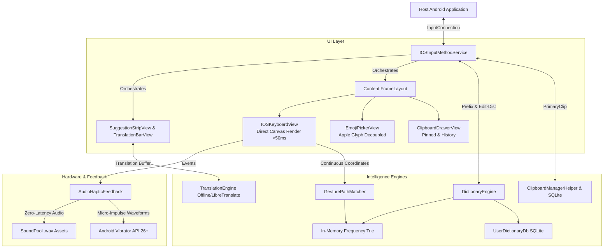

# Architecture Specification: iOS Keyboard Clone for Android

This document details the internal systems architecture, rendering pipeline, haptics emulation, and text processing algorithms powering the rootless Android iOS Keyboard.

---

## 1. Custom Canvas Rendering Engine (`IOSKeyboardView`)

Unlike standard hybrid or View-heavy keyboard implementations that instantiate dozens of nested `Button` or `TextView` objects inside XML layouts, this project utilizes a **single custom Canvas View**:
- **Key Geometry:** Row heights and column weights are calculated dynamically in `KeyboardLayout.measure()`.
- **Physical Elevation:** Each key is drawn with a bottom drop shadow (`RectF(left, top + offset, right, bottom + offset)`) with a 5dp corner radius, mirroring iOS's tactile appearance.
- **Microsecond Touch-to-Frame Response:** By directly intercepting `onTouchEvent` and dispatching invalidation rects, keystrokes are processed within a single frame (<8.3ms at 120Hz, <16.6ms at 60Hz).
- **Magnifier Balloon Popup (`KeyMagnifierPopup`):** Rather than spawning a separate Android `PopupWindow` (which introduces window manager IPC overhead), the magnifier bubble is drawn directly into the upper canvas layer on `ACTION_DOWN` / `ACTION_MOVE`, achieving instantaneous positioning.

---

## 2. Low-Latency Keystroke Audio & Taptic Engine Pipeline

### Keystroke Audio
- Uses Android `SoundPool` configured with `USAGE_ASSISTANCE_SONIFICATION` and `CONTENT_TYPE_SONIFICATION`.
- Keystroke audio files are loaded directly into uncompressed PCM memory buffers at startup.
- Three distinct acoustic signatures:
  1. **Standard key:** High-transient 2200Hz click with steep exponential decay (15ms duration).
  2. **Delete key:** Deeper, woody 1350Hz resonance (22ms duration).
  3. **Return / Space:** Muffled acoustic tap at 1650Hz.

### Apple Taptic Engine Emulation
Android haptic motors vary widely in hardware response times. To achieve the signature Apple "taptic click":
- On Android 8.0+ (API 26 to API 35+), `VibrationEffect.createOneShot(durationMs, amplitude)` is utilized with tailored microsecond pulses:
  - Standard keys: 10ms at amplitude scaled to user settings.
  - Delete key: 12ms at 85% amplitude.
  - Space/Return: 14ms firm pulse.
  - Spacebar Trackpad: Continuous micro-ticks (1 tick per 12dp traversed).

---

## 3. Offline Dictionary & Autocorrect Engine

### Trie Architecture
- Word frequencies from curated lexicons (`en_words.txt`, `es_words.txt`, `fr_words.txt`, `de_words.txt`) are loaded asynchronously into a compact in-memory character Trie.
- Each `TrieNode` stores transitions in a lightweight sparse array/map and records word frequency.

### Autocorrection Algorithm (SymSpell/Levenshtein)
1. **Exact match check:** If typed word exists in the Trie, it is selected as center candidate.
2. **Prefix suggestions:** Words sharing the current prefix are retrieved and sorted by frequency.
3. **Edit-distance search:** When a typo is detected, a recursive Trie traversal searches candidates within edit distance $\le 2$, penalizing substitutions and transpositions.
4. **iOS UI Presentation:** The corrected word appears in the center column of `SuggestionStripView` enclosed in quotes (`"the"`), while the verbatim typed characters appear in the left column. Pressing Space commits the center autocorrect word automatically.

---

## 4. Spacebar Cursor Trackpad Mode

Holding down the Spacebar key for $>350$ms activates trackpad mode:
1. Keyboard layout visually fades to 40% alpha.
2. A subtle translucent blue trackpad tint illuminates the keyboard canvas.
3. Moving the finger horizontally calculates relative $dx$ deltas.
4. Every 12dp delta triggers an atomic cursor shift in the host text field via `InputConnection.setSelection()` accompanied by a micro-haptic tick.
